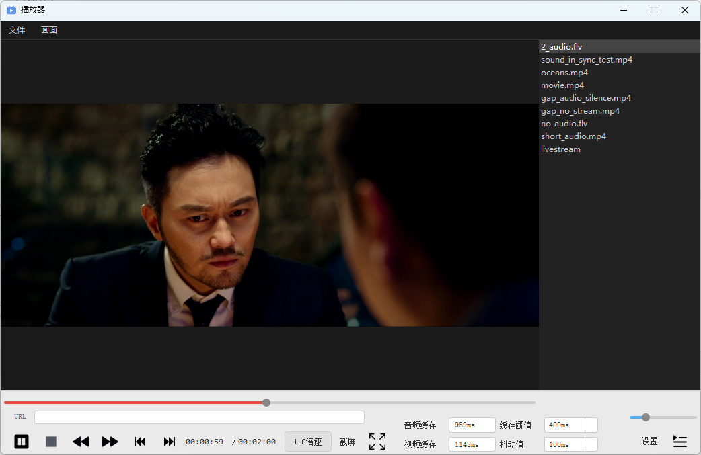

# Qt 跨平台媒体播放器

一款基于 **Qt + FFmpeg + SDL2** 开发的跨平台桌面媒体播放器，采用 **UI 与播放核心分离** 的架构设计，便于后续向 Android / iOS / Linux / macOS 等多平台迁移。支持本地文件和网络链接播放。



---

## 目录

- [特性](#特性)
- [项目架构](#项目架构)
- [目录结构](#目录结构)
- [构建说明](#构建说明)
- [操作说明](#操作说明)
- [技术实现](#技术实现)
- [第三方库](#第三方库)
- [参考资源](#参考资源)

---

## 特性

| 功能 | 说明 |
|------|------|
| 基础播放 | 播放 / 暂停 / 停止、上一首 / 下一首 |
| 进度控制 | 精确 Seek、快进 / 快退（默认步长 10 秒） |
| 倍速播放 | 支持变速播放 |
| 音量调节 | 滑块控制音量 |
| 播放列表 | 本地文件列表管理、支持打开网络串流 |
| 截屏 | 一键截取当前视频画面 |
| 缓存显示 | 实时显示音视频缓存时长 |
| 低延迟直播 | 针对直播场景优化缓存策略，降低延迟 |
| 全屏播放 | 支持全屏按钮与 **ESC** 键退出全屏 |
| 画面变换 | 支持视频旋转（0° / 90°）与水平 / 垂直镜像翻转 |

---

## 项目架构

播放器整体分为 **UI 层** 与 **核心层**，通过消息队列进行异步通信：

```
┌─────────────────────────────────────┐
│            UI 层 (Qt)                │
│  HomeWindow / DisplayWind / Playlist │
└──────────────┬──────────────────────┘
               │ AVMessage 消息队列
               ▼
┌─────────────────────────────────────┐
│        媒体控制层 (ijkmediaplayer)    │
│   状态管理 │ 线程调度 │ 接口封装       │
└──────────────┬──────────────────────┘
               │
               ▼
┌─────────────────────────────────────┐
│        播放核心层 (ff_ffplay)        │
│  FFmpeg 解码 │ SDL2 渲染 │ 音视频同步  │
└─────────────────────────────────────┘
```

- **UI 与核心解耦**：所有播放状态通过 `FFP_MSG_*` 消息异步回调到 UI 线程，避免在解码线程中直接操作界面。
- **模块化构建**：使用 `.pri` 文件按功能拆分，物理目录与构建模块一一对应，方便维护与复用。

---

## 目录结构

```
.
├── main.cpp                 # 程序入口
├── player.pro               # 主工程文件
├── resource.qrc             # Qt 资源文件
├── third_party.pri          # 第三方库配置（FFmpeg、SDL2）
│
├── core/                    # 播放核心模块
│   ├── core.pri
│   ├── ff_ffplay.cpp / .h      # FFmpeg 解码与渲染核心
│   ├── ff_ffplay_def.cpp / .h  # 数据结构定义
│   ├── ijkmediaplayer.cpp / .h # 媒体播放器控制接口
│   ├── videofilter.cpp / .h    # 视频滤镜（旋转、镜像）
│   ├── imagescaler.h           # 图像缩放
│   └── ff_fferror.h            # 错误码定义
│
├── ui/                      # 用户界面模块
│   ├── ui.pri
│   ├── homewindow.cpp / .h / .ui   # 主窗口
│   ├── displaywind.cpp / .h / .ui  # 视频显示窗口
│   ├── playlistwind.cpp / .h / .ui # 播放列表面板
│   ├── urldialog.cpp / .h / .ui    # 网络流输入对话框
│   ├── customslider.cpp / .h       # 自定义进度条
│   ├── screenshot.cpp / .h         # 截屏功能
│   └── toast.cpp / .h              # 提示浮层
│
├── media/                   # 媒体列表模块
│   ├── media.pri
│   ├── medialist.cpp / .h      # 媒体数据模型
│   └── playlist.cpp / .h / .ui # 播放列表 UI 与逻辑
│
├── common/                  # 公共基础模块
│   ├── common.pri
│   ├── ffmsg.h / ffmsg_queue.cpp / .h   # 消息队列
│   ├── globalhelper.cpp / .h            # 全局工具函数
│   ├── sonic.cpp / .h                   # 音频变速处理
│   ├── ijksdl_timer.cpp / .h            # SDL 定时器封装
│   ├── util.cpp / .h                    # 通用工具
│   └── log/
│       ├── easylogging++.cc / .h        # 日志库
│
├── ffmpeg-4.2.1-win32-dev/  # FFmpeg 开发库
├── SDL2/                    # SDL2 开发库
└── ...
```

---

## 构建说明

### 环境要求

- Qt 5.15+（Widgets 模块）
- MSVC 2019 / MinGW（Windows）或 GCC（Linux）
- FFmpeg 4.2.1 开发库
- SDL2 开发库

### 编译步骤

1. 使用 **Qt Creator** 打开 `player.pro`，直接构建运行。
2. 或在命令行执行：

```bash
qmake player.pro
make          # Linux / macOS
nmake / jom   # Windows (MSVC)
```

> 运行前请确保 `ffmpeg-4.2.1-win32-dev/lib` 与 `SDL2/lib/x86` 下的动态库已放入可执行文件同级目录，或已配置系统环境变量。

---

## 操作说明

- **打开文件**：加载本地视频文件
- **打开网络流**：输入 HTTP / RTMP 等流媒体地址
- **播放列表**：管理播放队列，支持上一首 / 下一首切换
- **进度条**：拖动跳转，实时显示当前播放进度
- **音量条**：调节输出音量
- **倍速按钮**：切换播放速度
- **截屏按钮**：保存当前画面到本地
- **全屏按钮 / ESC**：进入或退出全屏模式
- **画面翻转菜单**：旋转视频或进行水平 / 垂直镜像

---

## 技术实现

### Seek 流程

1. UI 层获取视频总时长并显示；
2. 用户拖动进度条后，将比例换算为毫秒级目标位置；
3. 通过消息机制下发 `FFP_REQ_SEEK`；
4. 核心层调用 `ffp_seek_to_l` → `stream_seek` 完成跳转。

### 播放完毕检测

针对纯音频、纯视频、音视频并存三种场景，分别检测 `eof`、`audio_no_data`、`video_no_data` 标志位，当所有有效流均读尽数据后，通过消息队列向 UI 发送 `FFP_MSG_PLAY_FNISH`，触发停止播放。

### 视频滤镜

利用 FFmpeg `avfilter` 滤镜图实现：
- 90° 顺时针旋转（`transpose=1`）
- 水平镜像（`hflip`）
- 垂直镜像（`vflip`）

通过重新初始化滤镜链，在解码后、渲染前对视频帧进行实时处理。

---

## 第三方库

### FFmpeg

- 解码：libavcodec、libavformat
- 滤镜：libavfilter
- 重采样：libswresample
- 图像转换：libswscale
- 工具：libavutil

### SDL2

- 视频画面渲染（OpenGL / Direct3D 底层封装）
- 音频输出

### easylogging++

轻量级 C++ 日志库，支持文件持久化与终端同时输出。项目内已配置按日期分文件存储，格式示例：

```
[2026-04-16 14:30:00 | INFO] main(L45) logger test
```

---

## 参考资源

- [在线转换图标](https://convertio.co/zh/)
- [Qt 设置应用程序图标](https://blog.csdn.net/hw5230/article/details/129447066)
- [QT 解决 qRegisterMetaType 报错](https://blog.csdn.net/Larry_Yanan/article/details/127686354)
- [Qt 发布 Release 版本（生成 exe）](https://blog.csdn.net/weixin_44793491/article/details/118307151)

